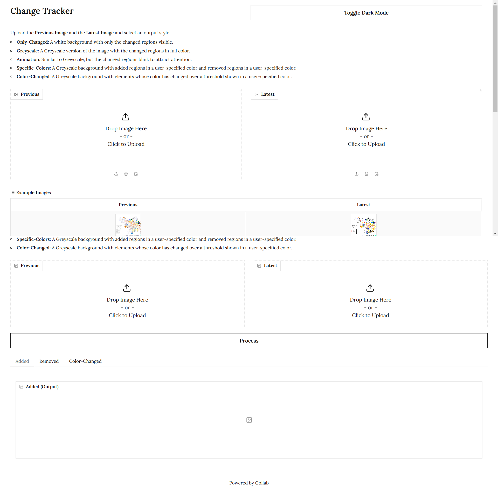

# FastAPI YOLOv11 Object Detection Application

This project is a FastAPI application that utilizes a custom YOLOv11 model for object detection. The model has been trained on a specific dataset and deployed using Roboflow. This README provides instructions on how to set up and run the application.

## Project Structure

```bash
root/
├── app.py   # Your Gradio script
├── test/
│   ├── image1.jpg
│   ├── image2.png
│   ├── image3.jpeg
│   └── ...                    # Example test images
├── requirements.txt           # Dependencies for the FastAPI application
└── README.md                  # Project documentation
```

## Setup Instructions

1. **Clone the repository:**

    ```bash

    git clone https://github.com/dev3py/change-tracker-gradio.git
    cd change-tracker-gradio

    ```

2. **Create a virtual environment on Ubuntu (optional but recommended):**

    ```bash
    python -m venv venv
    source venv/bin/activate  # On Windows use `venv\Scripts\activate`
    ```

    **Create a virtual environment on Windows (optional but recommended):**

    ```bash
    python -m venv venv
    venv\Scripts\activate
    ```

3. **Install the required dependencies:**

    ```bash
    pip install -r requirements.txt
    ```

## Running the Application

To start the FastAPI application, run the following command:

```bash
python app.py
```

The application will be accessible at `http://127.0.0.1:7866`.

## Docker Build


```bash
docker build -t ctgr .
```

## Docker Run the Build

```bash
docker run -p 7866:7866 --name ctgr-container -d ctgr
```

## Usage

This is a Gradio-based application for detecting potholes in uploaded images. It uses a pre-trained detection model hosted on Roboflow via the `inference_sdk` API. The app dynamically loads test images from a local folder (`test`) and provides bounding boxes around detected potholes in bright orange.

### Features

* Upload images to detect potholes using a pre-trained model.
* Dynamically load test images from the `test` folder as examples.
* Displays detected potholes with bounding boxes and confidence scores.
* User-friendly interface powered by Gradio.
  
### Example Output

Below is an example output image showing the detected potholes with bounding boxes:


